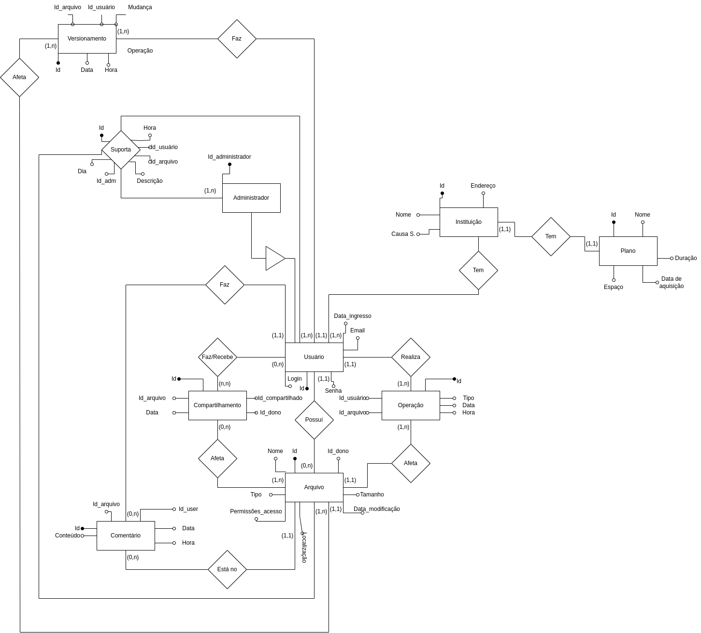
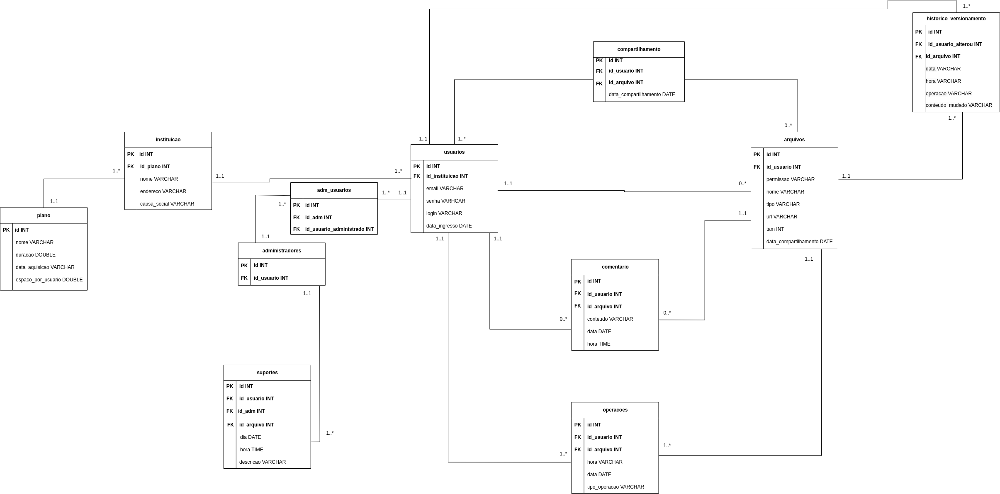

<h1>Sistema de Banco de Dados para Gerenciamento de Webdriver</h1>

<h2> Modelo Conceitual</h2>



<h2> Modelo Lógico</h2>



<h2> Modelo Físico</h2>

```SQL
CREATE TABLE IF NOT EXISTS plano (
    id_plano INT AUTO_INCREMENT,
    nome VARCHAR(40),
    duracao DOUBLE,
    data_aquisicao DATE,
    espaco_usuario DOUBLE,
    PRIMARY KEY(id_plano)
);

CREATE TABLE IF NOT EXISTS instituicao (
    id_instituicao INT AUTO_INCREMENT,
    nome VARCHAR(30) UNIQUE,
    causa_social VARCHAR(50),
    endereco VARCHAR(50),
    id_plano INT,
    PRIMARY KEY(id_instituicao),
    FOREIGN KEY(id_plano) REFERENCES plano(id_plano)
);

CREATE TABLE IF NOT EXISTS usuario (
    id_usuario INT AUTO_INCREMENT,
    login VARCHAR(40) UNIQUE,
    senha VARCHAR(10),
    data_ingresso DATE,
    email VARCHAR(40) UNIQUE,
    id_instituicao INT,
    PRIMARY KEY(id_usuario),
    FOREIGN KEY(id_instituicao) REFERENCES instituicao(id_instituicao)
);

CREATE TABLE IF NOT EXISTS adm_usuario (
    id_adm INT,
    id_usuario_adminstrado INT,
    FOREIGN KEY(id_usuario_adminstrado) REFERENCES usuario(id_usuario),
    FOREIGN KEY(id_adm) REFERENCES usuario(id_usuario)
);

CREATE TABLE IF NOT EXISTS administrador (
    id_adm INT AUTO_INCREMENT,
    id_usuario_adm INT,
    PRIMARY KEY(id_adm),
    FOREIGN KEY(id_usuario_adm) REFERENCES usuario(id_usuario)
);

CREATE TABLE IF NOT EXISTS arquivo (
    id_arquivo INT AUTO_INCREMENT,
    nome VARCHAR(30),
    tipo VARCHAR(10),
    permissoes_acesso VARCHAR(50),
    tamanho INT,
    data_ultima_mod DATE,
    localizacao VARCHAR(10),
    URL VARCHAR(50),
    id_usuario INT,
    PRIMARY KEY(id_arquivo),
    FOREIGN KEY(id_usuario) REFERENCES usuario(id_usuario)
);

CREATE TABLE IF NOT EXISTS suporte (
    id_suporte INT AUTO_INCREMENT,
    descricao VARCHAR(30),
    data DATE,
    hora TIME,
    id_usuario INT,
    id_arquivo INT,
    id_adm INT,
    PRIMARY KEY(id_suporte),
    FOREIGN KEY(id_usuario) REFERENCES usuario(id_usuario),
    FOREIGN KEY(id_arquivo) REFERENCES arquivo(id_arquivo),
    FOREIGN KEY(id_adm) REFERENCES administrador(id_adm)
);

CREATE TABLE IF NOT EXISTS compartilhamento (
    id_comp INT AUTO_INCREMENT,
    id_arquivo INT,
    data DATE,
    id_dono INT,
    PRIMARY KEY(id_comp),
    FOREIGN KEY(id_dono) REFERENCES usuario(id_usuario),
    FOREIGN KEY(id_arquivo) REFERENCES arquivo(id_arquivo)
);

CREATE TABLE IF NOT EXISTS comentario (
    id_coment INT AUTO_INCREMENT,
    conteudo VARCHAR(30),
    data DATE,
    hora TIME,
    id_usuario INT,
    id_arquivo INT,
    PRIMARY KEY(id_coment),
    FOREIGN KEY(id_usuario) REFERENCES usuario(id_usuario),
    FOREIGN KEY(id_arquivo) REFERENCES arquivo(id_arquivo)
);

CREATE TABLE IF NOT EXISTS historico (
    id_historico INT AUTO_INCREMENT,
    conteudo_mudado VARCHAR(30),
    data DATE,
    hora TIME,
    id_usuario_alterou INT,
    id_arquivo INT,
    PRIMARY KEY(id_historico),
    FOREIGN KEY(id_usuario_alterou) REFERENCES usuario(id_usuario),
    FOREIGN KEY(id_arquivo) REFERENCES arquivo(id_arquivo)
);

CREATE TABLE IF NOT EXISTS operacoes (
    id_op INT AUTO_INCREMENT,
    data DATE,
    hora TIME,
    tipo_operacao VARCHAR(30) CHECK(tipo_operacao IN ('carregar', 'atualizar', 'remover')),
    id_usuario INT,
    id_arquivo INT,
    PRIMARY KEY(id_op),
    FOREIGN KEY(id_usuario) REFERENCES usuario(id_usuario),
    FOREIGN KEY(id_arquivo) REFERENCES arquivo(id_arquivo)
);

```

<h2>Contribuidores:</h2>
<ul>
  <li>Ana Beatriz de Lima Romero - 850038</li>
  <li>Gabriela Ribeiro Barbosa Lemos - 848843</li>
  <li>Guilherme Cavalcanti de Sá Barreto - 849537</li>
  <li>Pedro Henrique Afonso dos Santos - 849096</li>
</ul>
